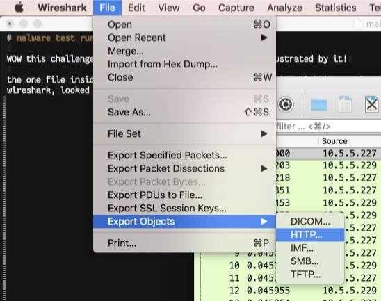

## malware test run ##

WOW this challenge RULED!!! i had a lot of fun being frustrated by it!

the one file inside the tarball is `malware-testrun.pcap`, which i opened up in
wireshark, looked at a conversation, and found the option to export all the
http response bodies (i.e. the files http serves you) as files



so just sorting through all this nonsense, there's something that sticks way
out: `ads.html` includes an image with a data-url as source, and javascript that
evals that source:

```html


<script type="text/javascript">
eval(atob(document.images[0].src.replace(/.*,/, "")));

// Show ads
function showImage(i){
    document.images[0].src="images/ad00" + i + ".png";
}

for (i=0;i<7;i++){
    setTimeout(showImage,2000*i,i);
}

</script>
```

let's de-base-64 that data url

```javascript
z="";function v(b){s='';for(i=0,l=b.length;i<l;i+=8){c=0;for(j=7;j>=0;j-=1){c+=b[i+7-j]<<j;}s+=String.fromCharCode(c);}return s;}function d(img){i=0;l=img.length;st=[];while(i<l){st[i]= img[i*4]&1;i+=1;}return v(st);}function f(){w=i.naturalWidth;h=i.naturalHeight;c=document.createElement("canvas");x=c.getContext("2d");c.width=w;c.height=h;x.drawImage(i,0,0,w,h);t=d(x.getImageData(0,0,w,h).data);if(t=t.match(/SHA.*SHA/)){z+=t[0].replace(/SHA/g,'');}};function q(){i=new Image();i.addEventListener('load',f,false);i.src="notit.png"}setTimeout(q,1000);function a(){eval(z)}setTimeout(a,200000)
```

let's blow that up to be readable

```javascript
z = "";

function v(b) {
  s = '';
  for (i = 0, l = b.length; i < l; i += 8) {
    c = 0;
    for (j = 7; j >= 0; j -= 1) {
      c += b[i + 7 - j] << j;
    }
    s += String.fromCharCode(c);
  }
  return s;
}

function d(img) {
  i = 0;
  l = img.length;
  st = [];
  while (i < l) {
    st[i] = img[i * 4] & 1;
    i += 1;
  }
  return v(st);
}

function f() {
  w = i.naturalWidth;
  h = i.naturalHeight;
  c = document.createElement("canvas");
  x = c.getContext("2d");
  c.width = w;
  c.height = h;
  x.drawImage(i, 0, 0, w, h);
  t = d(x.getImageData(0, 0, w, h).data);
  if (t = t.match(/SHA.*SHA/)) {
    z += t[0].replace(/SHA/g, '');
  }
};

function q() {
  i = new Image();
  i.addEventListener('load', f, false);
  i.src = "notit.png"
}
setTimeout(q, 1000);

function a() {
  eval(z)
}
setTimeout(a, 200000)
```

reading from the bottom up, we set a long-ass timeout on `a()`, a 1s timeout
on `q()`. `a()` evals the empty string `z`, which isn't obviously useful, so
we should figure out what `q()` does with `z`

the `q()` function creates a new Image object, sets `f()` to run when the image
loads, and sets the source of that image to `notit.png`

the name of `notit.png` probably means that while there's no flag in that file,
it is an important part of the challenge because it's still there.

when an image loads, `f()` uses a 2d canvas to decode its pixel data into a big
string, yanks the part between "SHA" strings, and prepends it to `z`

so what we have is a way to hide js in images that we can later run

popping back out to the `script` tag in `ads.html`, we can then see from the
`for` loop that we load each of the images in order; without having to trace js
execution, at this point we're guessing that we have some hidden js in between
"SHA" strings hidden in png images, so let's just write a quick and dirty html
to decode them, which I did in `tester.html` (it's long, click it above)

`tester.html` prints out some ghastly stuff with empty arrays, bangs, pluses,
parens, and such. while i have [no doubt this is valid js](https://www.destroyallsoftware.com/talks/wat),
i want a better way to decode it

so i looked around a bunch and found out from a search for
"javascript obfuscate array not" there's a package called
[JSFuck](http://www.jsfuck.com/) that does this, and an npm package called
[jssuck](https://github.com/lateau/jssuck) that undoes this

and with that:

```
> jssuck -p mangled.js
x = new Date();
if (x.getDate() == "23" && x.getHours() == "12") {
  alert("flag{02aa1488771e325eef9b0e5f0d2db626}")
}
```
