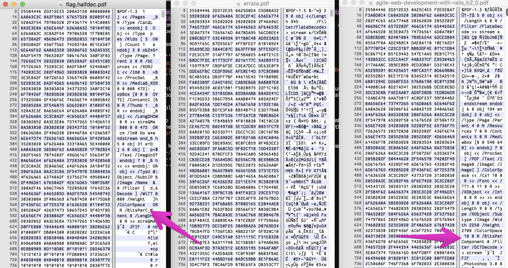

# stack overflow

file that claimed to be a pdf encrypted with some buggy hell crypto from stack
homeworkflow

because i worked really hard to make [the clemency documentation](http://blog.legitbs.net/2017/07/the-clemency-architecture.html)
compile to have a consistent checksum, i'm over my hangups about busting a pdf
open in a hex editor

baaaassssiiiiccccallllyyyyy

```python
secret = os.urandom(16)
crypto = AES.new(os.urandom(32), AES.MODE_CTR, counter=lambda: secret)
```

this sets up CTR mode with a counter that never changes, turning it from a
good cipher and mode into basically xoring your text against a static string

lol

so i guessed that the pdf started with the `%PDF` magic number, and just xor'd
the other parts of the 16-byte block with zeroes (leaving them the same), using
`brute.rb`

i kept a couple pdfs (the cLEMENCy `errata.pdf` and some random other pdf in
`~/Downloads`, making sure to have ones that had embedded images, because the
pdf under consideration also had keywords that pointed to images

from there it's a known plaintext attack on a xor

here's a half-decoded bit on the left, with arrows calling out a plaintext on
the right that i want to map into the left



what i do then is figure out which bits in the byte i want to flip at each
position, and encode them into the `pt_header` (plaintext header) part of
the ruby script

in this case, i want to flip '_' 0x5f into 'o' 0x6f, which involves the left
hexit, and changing it from 0b0101 to 0b0110. This requires toggling the two
least significant bits, which is 0b0011, or 0x3. the right 0xf hexit stays the
same, so i toggle 0b000, or 0x0, or 0.

so starting with

```ruby
pt_header = "%PDF-1.3 \x0a\x31\x20\x00\x00\x00\x00"
```

i now know one more bit, and make it

```ruby
pt_header = "%PDF-1.3 \x0a\x31\x20\x30\x00\x00\x00"
#                                   ^ changed this
```

just do that incrementally, you get a working pdf, and can retype the flag
out of it
